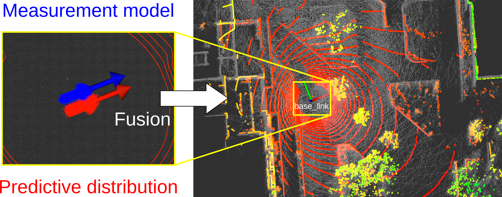

# mcl3d_ros
mcl3d_ros is a ROS package of 3D-LiDAR-based Monte Carlo localization. It also contains localization methods using distance-field-based optimization and extended-Kalman-filter-based fusion. The localizers work withtou INS such as odometry and IMU. Of course, INS can be available and it improves localization performance.


# Main characteristics

mcl3d_ros can efficiently perform 3D-LiDAR-based MCL. To achieve it, mcl3d_ros uses measurement model optimization using a distance field and fusion of it with MCL via importance sampling. In short, mcl3d_ros uses two probabilistic distributions are used to sample the particles and fuses them. For more details, please refer this [preprint](https://).

```
@misc{akai_arxiv2023_mcl3d,
  url = {https://arxiv.org/abs/},
  author = {Akai, Naoki},
  title = {Efficient Solution to {3D-LiDAR}-based {Monte Carlo} Localization with Fusion of Measurement Model Optimization via Importance Sampling},
  publisher = {arXiv},
  year = {2023}
}
```





# Install

```
$ cd /your/catkin_ws/src/
$ git clone https://github.com/NaokiAkai/mcl3d_ros.git
$ cd /your/catkin_ws
$ catkin_make
$ source devel/setup.bash
```

We tested mcl3d_ros on Ubuntu 20.04 with Noetic.


# How to use

Please first prepare a pcd file of your target environment and build a distance field of the pcd file.

```
$ roslaunch mcl3d_ros pc_to_df.launch pcd_file:=/your/pcd/file.pcd yaml_file_path:=/your/yaml/file.yaml yaml_file_path:=your_map_name.bin
```

A distance field can also be built from a point cloud published as a ROS message.

Then, localization can be executed.

```
$ roslaunch mcl3d_ros mcl.launch map_yaml_file:=/your/yaml/file.yaml
```

A configuration file for rviz is prepared in the rviz directory.

```
$ rviz -d rviz/mcl3d_ros.rviz
```

Note that other map formats are not supported currently.


# Parameters

There are launch files at the launch directory. Descriptions of all the parameters can be seen in the launch files.
